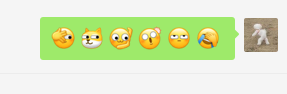

最近研究了一下unicode字体。记录一下

## 麻将

似乎红中渲染得不一样。

🀀🀁🀂🀃🀄🀅🀆🀇🀈🀉🀊🀋🀌🀍🀎🀏🀐🀑🀒🀓🀔🀕🀖🀗🀘🀙🀚🀛🀜🀝🀞🀟🀠🀡🀢🀣🀤🀥🀦🀧🀨🀩🀪🀫

## 最常用的 emoji

官网统计的使用频率，笑着哭频率最高。看了眼自己的微信常用表情也是赫然在列。看来人类的悲喜在世界范围内都是大抵相通的嘛。

## 查找支持unicode的字体

unicode的字符显示不出来大概率是字体/系统不支持。不过目前测试过浏览器对最新v15版的unicde最新添加的emoji都是支持的，兼容性应该比较不错。

下面的网站是某著名回答型社区推荐的资源，供查找支持某特定block的资源。

https://www.fileformat.info/info/unicode/block/index.htm

## 黑客帝国弹幕biubiu

来自 https://codepen.io/EpicCoder_2002/pen/KERjgm

用字符构成，6的不行

<iframe width="100%" height = "300px" src="./placeholder.html"> </iframe>

