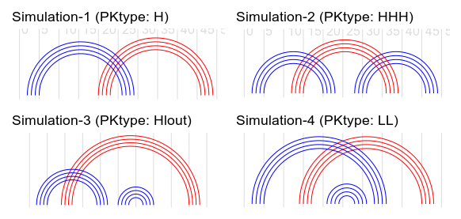
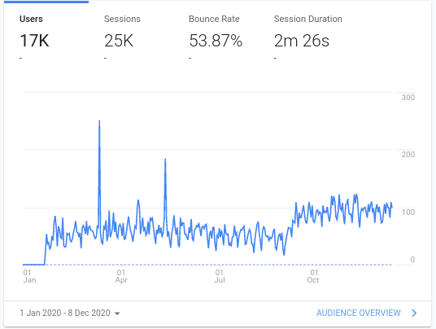
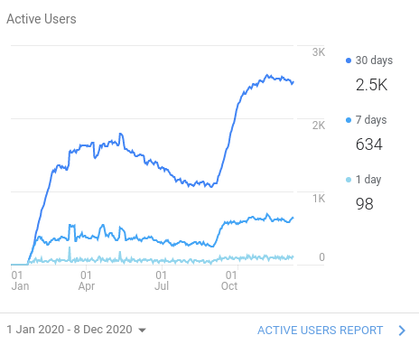
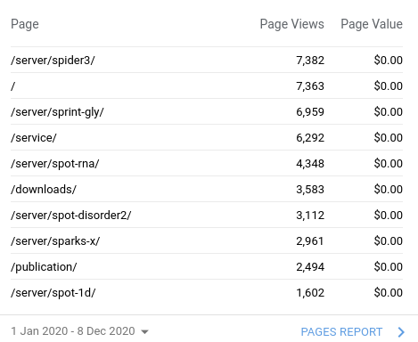
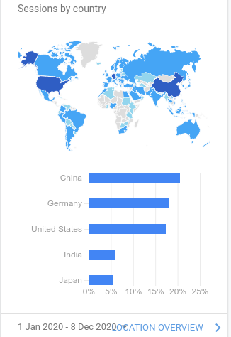

```{r setup, include=FALSE}
knitr::opts_chunk$set(echo = FALSE, message=FALSE)
library(dplyr)
library(kableExtra)
library(patchwork)
library(ggplot2)
```

## RNAmrf: align RNA sequences to family

- Fact: **ncRNA preserves secondary structure rather than sequence**

- Problem of aligning RNA sequences: 
    - HMM:  **not working**
    - Covariance Model(Infernal): encodes SS, **Only works for non-pseudoknot structure**
    - Markov Random Field: fully connected, that can handle arbitrary dependencies.
    
- Data
    - Simulated MSA
    - Rfam families with pseudoknot
    
- Evaluation
    - Alignment Accuracy
    - contact prediction using re-aligned MSAs
    
---
## Simulated MSA

```{r figsimulatess,fig.cap="Secondary structure of four basic pseudoknot types.",fig.height=8, out.width="90%"}
 

 
```

---
## Sample of Simulated MSA (Simulation_1)

```
# STOCKHOLM 1.0

seq292  CCCUUGUUgga.GCCCCG-AGUUAAAAGGCAG-g...G-UGAU-GAACUU
seq293  GAAGACCGgc..UA--ACUGUUGA-UCUUCC-Uggg.-GC--UGCCAACG
seq294  UAAUGC-Ucuc.GCG-A-UCCAGA-CAUUGAUGc...GGCUCC-GCUGGC
seq295  GCGCGGUGgacgACCCG-ACUACU-CGCGGCA-gu..CAGAUCUGGUAGU
seq296  -AAAA-AGcuc.AGC-CAACUAACGUUUUACAAac..GCGGCCACUUAGU
seq297  AGCACGGAuc..UCGGCUAGUCUCCGUGCGCUAuaagC-CU-ACGAGACA
seq298  CGAAGU-Ucg..--AGGUUCAGGGUCUUCUCA-gc..-GA--A-UCCUGA
seq299  AUCUCGAGucc.C-U-CAAGUGUC-GAGAGC-Ucua.UUUCACUCACACU
seq300  ACGACCGGag..GAGAC-UCUUAGCGUCGAUAUuc..UCC-UUCAUAAGU
#=GC RF xxxxxxxx....xxxxxxxxxxxxxxxxxxxxx....xxxxxxxxxxxxx
#=GC SS .((((...----.......AAAA..))))....----........aaaa.
//

```
(): stem
Aa: pk-stem

---
class: center, middle, inverse

## Results for Simulated RNA alignment

---

```{r tabsynth, echo=FALSE}
load("~/GIT/thesis_tc/data/synth_tab_sel.rda")

synth_tab_sel %>% 
  select(-caseid) %>% 
  select(1:7,11:13) %>% 
kable(
  booktabs = T,digits=2,
       col.names=c("method",rep(c("SEN","PPV","F1"),3))) %>%
  kable_styling() %>%
  add_header_above(c(" ", "PK alignment" = 3,"non-PK alignment"=3,"Contact Prediction"=3)) %>%
    pack_rows(index=table(synth_tab_sel$caseid)) %>% 
  column_spec(4,bold=T)

```

---
## Contact prediction performance (1, 2)

```{r synthcontact, echo=FALSE,fig.align="center"}
# load(here::here("data/synth_contact.rda"))
# load("~/GIT/thesis_tc/data/synth_contact.rda")
load("~/GIT/thesis_tc/data/patch_rscape_data.rda")

wrap_elements(grob_ss1,ignore_tag=TRUE)+ggtitle("Simulation-1",subtitle="H")+
  gglists[[1]]$rnamrf+gglists[[1]]$cmalign+
  wrap_elements(grob_ss2,ignore_tag=TRUE)+ggtitle("Simulation-2",subtitle="HHH")+
  gglists[[2]]$rnamrf+gglists[[2]]$cmalign+
  plot_layout(widths=c(1,1,1))

```

---

## Contact prediction performance (3, 4)
```{r synthcontact2, echo=FALSE,fig.align="center"}
  wrap_elements(grob_ss3,ignore_tag=TRUE)+ggtitle("Simulation-3",subtitle="HLout")+
  gglists[[3]]$rnamrf+gglists[[3]]$cmalign+
  wrap_elements(grob_ss4,ignore_tag=TRUE)+ggtitle("Simulation-4",subtitle="LL")+
  gglists[[4]]$rnamrf+gglists[[4]]$cmalign +
  plot_layout(widths=c(1,1,1))
```


---
class: center, middle, inverse

## Results for RFAM families

---
## Alignment accuracy & contact prediction

```{r rfameval, echo=FALSE,fig.height=7,fig.width=9,out.width="90%", fig.align='center'}
load("~/GIT/thesis_tc/data/rfam_patch2.rda")
# load("~/GIT/thesis_tc/data/rfam_patch4.rda")


  rfam_patch2&theme(legend.position = "right")
```

---
## Predicted Contact Map for RF01725 and RF02996

```{r rfamcontact,fig.height=6.5, warning=FALSE,fig.align='center',fig.cap="cmalign MSA failed to capture the PK stem"}
load("~/GIT/thesis_tc/data/rfam_patch3.rda")

rfam_patch3
```

---
## Summary

- cmalign does not align Pseudoknot well -> predicted less PK pair and more false pairs.

- RNAmrf aligns better than cm if seed MSA is deep (neff >40)

---
## Next

- Develop a comprehensive pseudoknot alignment benchmark dataset & evaluation tools
  - simulated (here)
  - 37 Rfam PK families (here)
      - 500+ Rfam families have pseudoknot, structure not available, not verified.
  - Pseudobase++ database
      - use RNAcmap to generate MSA on Pseudobase++ RNAs
      - re-align with RNAmrf
      - benchmark contact prediction performance 

- Compare with recent seq-MRF align methods
  - 3 papers, 1 in Plos computational biology(Sean Eddy's group).
  - But their code are not ready to use.


---
class: center, middle, inverse

## Traffic Statistics for Sparks-lab.org 

---

## Sessions & Users statistics

.pull-left[

```{r fig.align='center'}
 

 
```
- September boost: Probably due to the start of the new semester
- Up/downs: weekends
- Interestingly, Germany rank higher than the US.
]

.pull-right[

```{r fig.align='center',fig.height=5}
 

 
```

]

---

## Top Visited Pages

.pull-left[

```{r fig.align='center'}
 

 
```

]

.pull-right[

- Top visited servers:
    1. spider3: protein SS prediction
    1. sprint-gly: predict N- and O-linked glycosylation sites
    1. spot-rna: RNA SS prediction
    1. spot-disorder2: Protein disorder prediction
    1. sparks-x: Protein fold recognition
    1. spot-1d: protein SS prediction

]

---
## Sessions by country 


.pull-left[
```{r fig.align='center'}
 

 
```
]

.pull-right[
Reference: Nature index by country, 2020
1.	United States
2.	China	
3.	Germany
5.	Japan	
12. India
]

  