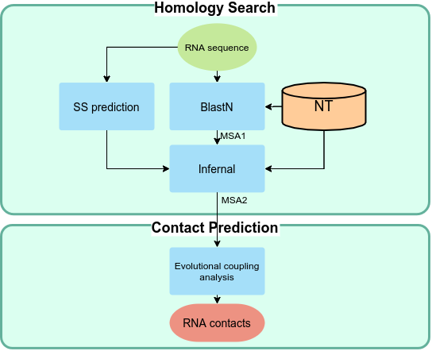
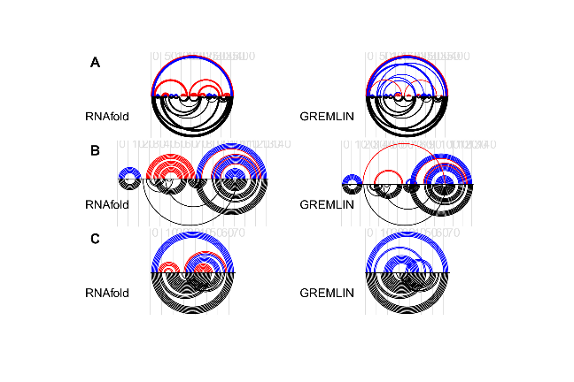
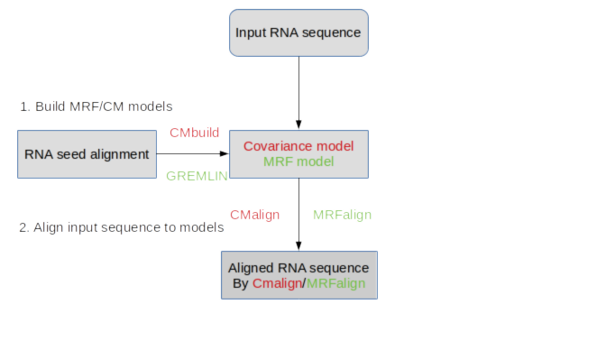

```{r setup, include=FALSE}
knitr::opts_chunk$set(echo = FALSE, message=FALSE)
library(dplyr)
library(kableExtra)
library(patchwork)
library(ggplot2)
```


## Projects

- **RNAcmap**
    - RNA contact prediction 

- **RNAmrf**
    - RNA multiple sequence aligner

- DFIRE_RNA
    - RNA structure knowledge-based energy function
    
---

## RNAcmap

- Goal: RNA contact prediction using evolutional coupling

- Method: RNA family MSA -> covariance signal -> contacts

```{r figflowchart1, fig.align='center',out.height=400}
 

 
```


---
## Comparing RNAcmap MSA with RFAM and Blast-N

```{r fig2, , fig.align='center', fig.height=6,fig.width=9}

load("~/GIT/rna_coup_paper/ver3/rdata/gg2.rda")

library(patchwork)

patch=
  gg2$f1+ labs(title="A",y="MCC")+
  gg2$prec+labs(title="B",y="Precision")+
  gg2$sens+labs(title="C",y="Sensitivity") & theme(legend.position="bottom")& ylim(0,1)

patch + plot_layout(guides="collect")


```

---

## Comparing predicted Secondary structure (RNAfold/RNAcmap)
```{r examplefig, fig.height=5, fig.cap="red: false positives,black:reference, blue: correctly predicted"}



```

---

class: center, middle, inverse

## RNAmrf

---

## RNAmrf: align RNA sequences to family

- Fact: **ncRNA preserves secondary structure rather than sequence**

--

- Problem of aligning RNA sequences: 
    - HMM:  **not working**
--
    - Covariance Model(Infernal): encodes SS, **Only works for non-pseudoknot structure**
--
    - Markov Random Field: fully connected, that can handle arbitrary dependencies.

--

- Data
    - Simulated MSA
    - Rfam families with pseudoknot
    
- Evaluation
    - Alignment Accuracy
    - contact prediction using re-aligned MSAs

---
## Flowchart of RNAmrf

```{r figflowchart, fig.align='center'}
 

 
```


---
## Alignment accuracy & contact prediction

```{r rfameval, echo=FALSE,fig.height=7,fig.width=9,out.width="90%", fig.align='center'}
load("~/GIT/thesis_tc/data/rfam_patch2.rda")
# load("~/GIT/thesis_tc/data/rfam_patch4.rda")


  rfam_patch2&theme(legend.position = "right")
```

---
## Predicted Contact Map for RF01725 and RF02996

```{r rfamcontact,fig.height=6.5, warning=FALSE,fig.align='center',fig.cap="cmalign MSA failed to capture the PK stem"}
load("~/GIT/thesis_tc/data/rfam_patch3.rda")

rfam_patch3
```

---
## Publications

https://www.researchgate.net/profile/Tongchuan-Zhang/research

---
## About me

.pull-left[

]

.pull-right[
- <i class="fa fa-envelope"></i> tongchuan.zhang@outlook.com
- <i class="fa fa-github"></i> [github.com/tcgriffith](https://github.com/tcgriffith)
- <i class="fa fa-home"></i> [tc.rbind.io](https://tc.rbind.io)
]


